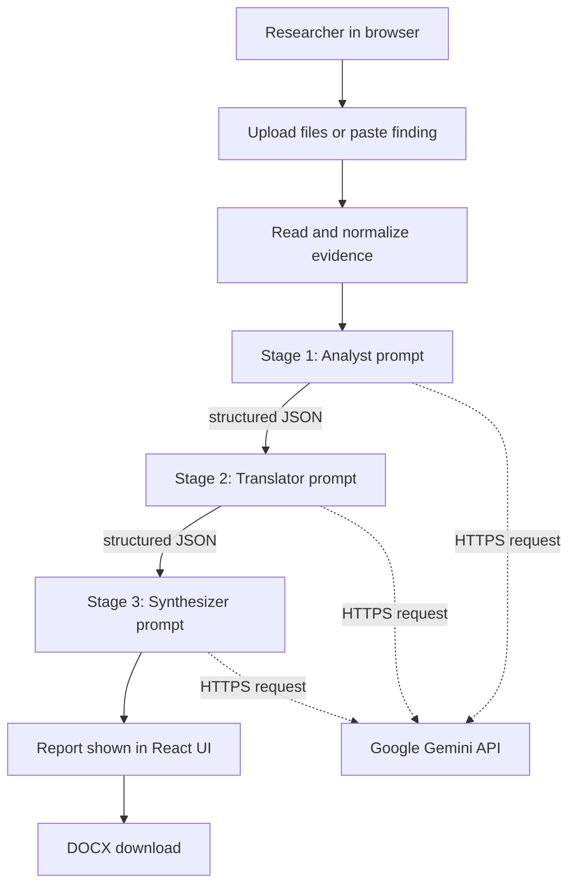

# BugsCry Technical Report

**Competition preparation and project Q&A guide**
**Prepared:** 7 October 2026
**Project status:** Academic research prototype

## 1. Executive summary

BugsCry is a browser-based tool that turns security evidence supplied by a researcher into a structured vulnerability analysis and a downloadable DOCX report. It accepts pasted findings and uploaded files, sends the evidence through three sequential Gemini stages, and presents the resulting classifications, confidence, evidence excerpts, business impact, remediation, and review flags.

The implementation is a React and TypeScript single-page application. The three stages are **role-specialized prompts**, not three separate model providers: Analyst, Translator, and Synthesizer all call the Google Gemini API. The stages use three configured API keys in a rotation order and a list of Gemini model fallbacks. This is a prototype for analysis and reporting; it does not scan targets, prove vulnerabilities, or replace a human security review.

## 2. Competition pitch

> BugsCry helps security researchers turn raw vulnerability evidence into clearer, more actionable reports. It analyzes supplied evidence in three sequential stages: first assessing findings and mapping them to CWE, OWASP, and CVSS; then translating technical impact and remediation for business and developer audiences; and finally assembling a structured report with evidence excerpts and review flags. Researchers can review the result in the browser and export it as a DOCX. It is an evidence-assistance and reporting prototype, not an automated scanner or a substitute for security validation.

## 3. Problem and proposed contribution

Security teams often receive scanner output, HTTP traces, screenshots, code snippets, and researcher notes in different formats. Turning those inputs into a report takes time and requires both security knowledge and clear communication. Findings can also be false positives or lack enough evidence to justify a confident severity rating.

BugsCry explores three workflow ideas:

1. **Evidence-first analysis:** Ask the model to support claims with excerpts from the supplied material and to consider benign explanations.
2. **Role separation:** Use different structured prompts for technical analysis, business translation, and final report synthesis.
3. **Dual-audience output:** Put technical remediation and executive-facing impact in one report, with uncertainty and review flags visible.

These are design goals. The current application does not automatically prove that a generated citation exactly matches the original evidence, and the role separation does not guarantee better accuracy by itself.

## 4. Architecture



### Current implementation boundaries

- The frontend calls Gemini directly. There is no application backend, database, job queue, or server-side orchestration layer in this repository.
- All three roles use the Gemini `generateContent` REST endpoint. Different prompts and stage inputs create the roles; this is not currently an OpenAI/Gemini/Claude ensemble.
- API keys are selected by environment variable and rotated between stages. Keys are operational credentials, not separate AI agents.
- Analysis state lives in React memory for the current browser session. There is no saved case history or server-side persistence.

### README versus implemented code

The README also describes a broader FastAPI backend and Gemini/OpenAI/Claude adapters. Those are research architecture claims, not the current web app's implementation. The checked-in application is a Vite/React frontend that calls Gemini directly and creates DOCX files with the JavaScript `docx` package. Describe FastAPI, OpenAI, Claude, and Python `python-docx` as proposed architecture or future work unless presenting a separate implementation.

## 5. End-to-end data flow

1. The user pastes a finding or selects files in the Analyzer section.
2. `fileToEvidence` checks each file, reads images and PDFs as base64, and reads other accepted files as text. `evidenceToParts` labels and converts those items into Gemini request parts.
3. Stage 1 receives the evidence and the Analyst prompt. It is asked for findings with verdict, confidence, severity, CWE, OWASP category, CVSS vector and score, evidence citations, false-positive reasoning, and a technical summary.
4. If Stage 1 returns no findings, the pipeline stops. Otherwise Stage 2 receives the Analyst JSON and is asked to write executive summaries, business impact, regulatory implications, remediation priorities, steps, and optional code examples.
5. Stage 3 receives both earlier JSON results and is asked to synthesize the final report, identify contradictions, and provide recommendations and review flags.
6. The report is rendered in the browser. A user can inspect findings, confidence, evidence, remediation, and review flags, then download a DOCX.

Calls are sequential: the Translator depends on Analyst output, and the Synthesizer depends on both earlier outputs. The app aborts an earlier run when a new run starts or the user resets the pipeline.

## 6. Evidence intake and limits

| Input | Current behavior |
|---|---|
| PNG/JPEG and recognized image files | Read as base64 and sent as Gemini inline image data |
| PDF | Sent as base64 inline document data; there is no local PDF text extraction pipeline |
| JSON, XML, CSV, HAR, logs, HTML, source files, and other non-image/non-PDF files | Read as text and sent as labeled evidence; there are no format-specific parsers |
| Pasted finding | Trimmed and added as a text part |
| File size | Files over 8 MiB are rejected |
| Text size | Text files are truncated at 400 KiB; pasted text is sliced at the same numeric limit |
| Blocked extensions | `.exe`, `.dpkg`, and `.apk` |

The tool analyzes the material supplied to it. It does not connect to a target, execute a scan, replay HTTP requests, validate authorization, or exploit vulnerabilities.

## 7. LLM orchestration and resilience

### Roles

- **Analyst:** Classifies findings, assesses validity and false-positive risk, assigns confidence and severity, and proposes CWE/OWASP/CVSS mappings.
- **Translator:** Converts the Analyst's structured results into executive-facing impact and developer-facing remediation.
- **Synthesizer:** Combines the prior results into the final report and is prompted to flag contradictions or uncertainty.

### Request handling

The current Gemini adapter sends JSON requests to `models/{model}:generateContent`, uses the `x-goog-api-key` header, requests JSON output, and has a 120-second timeout. It tries the stage's preferred key first, then rotates to the other configured keys. The current model fallback list is Gemini 3.8 Flash, 3.7 Flash, 3.6 Flash, 3.5 Flash, and 3.5 Flash-Lite. Gemini's model catalog can change, so these model IDs should be checked before a future release. [Google's model list](https://ai.google.dev/gemini-api/docs/models.md)

For transient HTTP 408, 429, and 5xx errors, the client retries once with a short exponential delay and jitter before moving to another model. An invalid-key/authentication response causes it to skip the rest of the model list for that key and rotate to another key. This helps with transient model load, but it cannot guarantee that Google's service will be available.

The response parser can remove a Markdown code fence or extract a JSON object/array from surrounding text. It then uses `JSON.parse` and a TypeScript type assertion; it does not perform runtime schema validation against the TypeScript interfaces.

## 8. Output and user interface

The React interface provides a landing page, explanation of the pipeline, evidence upload/paste controls, stage status, attempt logs, error display, report review, and DOCX export. The report contains an executive summary, overall risk rating, finding statistics, findings, recommendations, and review flags. Each finding can include verdict, severity, confidence, CWE, OWASP, CVSS vector, evidence, impact, executive note, remediation, and references.

The DOCX is generated in the browser using the `docx` and `file-saver` packages. There is no report template service or server-side document generation.

## 9. Technology stack

- **Language:** TypeScript and JavaScript
- **Frontend:** React 19, React Router 7
- **Build/dev server:** Vite 7
- **Styling:** Tailwind CSS 3, project CSS, and Radix-based UI components
- **AI integration:** Gemini REST API via browser `fetch`
- **Document generation:** `docx` and `file-saver`
- **Deployment targets configured in the repository:** Netlify (`netlify.toml`) and GitHub Pages (GitHub Actions workflow)

### Main source files

| File | Responsibility |
|---|---|
| `src/hooks/usePipeline.ts` | Pipeline sequence, cancellation, stage status, and UI state |
| `src/lib/gemini.ts` | Gemini request, key/model rotation, retries, and JSON parsing |
| `src/lib/files.ts` | File reading, limits, and evidence-to-request conversion |
| `src/lib/prompts.ts` | Role prompts and expected JSON structures |
| `src/types/index.ts` | TypeScript data structures for evidence, stages, and reports |
| `src/sections/Analyzer.tsx` | File/paste input, pipeline status, and errors |
| `src/sections/ReportSection.tsx` | Report review UI and download action |
| `src/lib/docxExport.ts` | Browser-side DOCX construction |
| `vite.config.ts` | Vite plugins, source alias, and local server port |
| `.github/workflows/static.yml` | GitHub Pages build and deployment workflow |
| `netlify.toml` | Netlify build command, publish directory, and SPA fallback |

## 10. Configuration and deployment

The local development command is `npm run dev`; the configured Vite port is 3000. A production build uses `npm run build` (`tsc -b && vite build`) and writes the static site to `dist/`.

The app expects these environment variable names:

```text
VITE_GEMINI_API_KEY_ANALYST
VITE_GEMINI_API_KEY_TRANSLATOR
VITE_GEMINI_API_KEY_SYNTHESIZER
```

For local development, place values in the root `.env.local`; that file is ignored by Git. `.env.example` documents the variable names without values. For GitHub Pages, add the corresponding values as GitHub Actions secrets because the workflow checks out the repository rather than your computer's `.env.local`. For Netlify, configure the variables in the site's build environment. Deploy again after changing a build-time variable.

**Security boundary:** Vite exposes `VITE_*` variables in the compiled browser bundle. Therefore these values can be extracted by anyone using the deployed site. The current setup keeps literal values out of tracked source, but it does not make the API keys secret in production. A backend proxy is required to keep provider keys server-side. Google also advises against exposing Gemini keys in client-side production code. [Gemini API key security guidance](https://ai.google.dev/gemini-api/docs/api-key)

## 11. Security, privacy, and trust boundaries

- Evidence is sent directly from the browser to Google Gemini over HTTPS. The project UI tells users not to upload data subject to disclosure restrictions.
- The repository has no backend storage, so it does not persist uploaded evidence or reports on a BugsCry server. Browser state is temporary; Google receives the request content for processing under the user's API setup and Google's terms.
- The inputs must be authorized for analysis. The tool is documentation/analysis support, not an authorization mechanism.
- Evidence excerpts and mappings are generated by an LLM. Prompt instructions encourage grounding; the code does not prove that a citation is real, that a vulnerability is exploitable, or that a CVSS vector is mathematically consistent.
- Treat uploaded text as untrusted. Prompt injection and misleading scanner output are not comprehensively neutralized by this prototype.
- Human review is represented by confidence and `reviewFlags` in the output. There is no built-in approve/modify/reject workflow, reviewer identity, audit trail, or second-person sign-off.

## 12. Research claims and evaluation

The README describes a preliminary evaluation on a 200-finding dataset and reports validity-classification precision **0.91**, recall **0.87**, and F1 **0.89**. Present these as results reported by the research work, not as a guaranteed accuracy level for every input or as a benchmark reproduced by this web application. The current codebase does not include the dataset, a repeatable evaluation harness, or scripts that reproduce those metrics.

The README lists future baseline comparisons against a single-model workflow, a hybrid SAST + LLM workflow, and manual reporting. Do not claim those comparisons were executed unless you can point to the paper's experiment results and methodology.

## 13. Limitations and next steps

### Current limitations

1. Browser-exposed API keys; no backend proxy.
2. Dependence on Gemini availability, model access, quotas, and key validity.
3. No actual scanner or target integration.
4. Prompt-level grounding without runtime quote verification or output schema validation.
5. CVSS values are model-generated rather than independently calculated.
6. File handling is generic text/base64 conversion, not dedicated parsers for each scanner format.
7. Human review is a displayed flag, not a managed workflow.
8. No case persistence, team collaboration, audit log, or role-based access control.
9. No automated test suite is present in the project scripts; build/lint checks are separate from AI quality evaluation.

### Sensible roadmap

- Add a backend API proxy and keep provider credentials in server-side secret storage.
- Validate model responses with runtime schemas and reject malformed or incomplete reports.
- Match evidence citations against source material; calculate CVSS using a dedicated implementation.
- Add parsers for common Burp, ZAP, Nuclei, SARIF, and scanner export formats.
- Build a review/approval workflow and persist reports with explicit access controls.
- Add reproducible benchmark data, prompts/version tracking, baseline comparisons, and human quality review.
- Add deployment health checks, quota handling, request budgets, and monitoring without logging secrets or sensitive evidence.

## 14. Demo outline

1. Explain that BugsCry analyzes evidence the researcher already collected; it is not scanning a live target.
2. Use a sanitized, authorized HTTP request/response or short finding note. Avoid real customer data and production secrets.
3. Show the Analyst stage and explain verdict, confidence, CWE/OWASP, CVSS, and evidence citations.
4. Show the Translator and Synthesizer stages progressing sequentially.
5. Inspect the generated finding, remediation, and review flags. Point out uncertainty rather than presenting the model as an authority.
6. Download and open the DOCX report.
7. If an API outage occurs, explain model/key fallback and retry behavior; do not promise uninterrupted service.

## 15. Likely competition questions

### “What does BugsCry do?”

It converts supplied security evidence into a structured analysis and a report with technical classifications, business impact, remediation, and review flags. It does not discover vulnerabilities by scanning a target.

### “Why use three stages?”

Each stage has one job and consumes structured output from the previous stage. That makes the workflow easier to inspect and lets the final stage compare prior results. It is a design hypothesis; the project still needs reproducible evaluation to demonstrate that three stages outperform a single prompt.

### “Is it really multi-agent?”

The application has three role-specialized LLM stages in sequence. In the current implementation they all use the Gemini API; the distinct roles come from prompts and intermediate JSON, not three independent provider platforms or autonomous software agents.

### “How does it reduce false positives?”

The Analyst prompt asks for cited evidence, counterfactual reasoning, a verdict, and calibrated confidence. The final UI surfaces uncertainty and review flags. These are safeguards that support analyst review, not a guarantee that false positives are eliminated.

### “How do you validate a CVSS score?”

The model is asked for a CVSS v3.1 vector and score. The current code does not independently calculate or validate the vector, so a security professional should verify it before relying on the report. A dedicated CVSS calculator is a roadmap item.

### “What happens to uploaded evidence?”

It is read in the browser and sent directly to the Gemini API for analysis. BugsCry does not store it on its own backend because there is no backend or database in the current implementation. Users should only submit evidence they are authorized to share with the provider.

### “Are the API keys hidden?”

No—not in the deployed browser application. Environment variables keep literal keys out of Git, but Vite embeds `VITE_*` values into client assets. A server-side proxy is required for production key confidentiality.

### “What if Gemini is unavailable?”

The client retries transient errors once with a delay, tries several current model IDs, then rotates among configured keys. This improves resilience to some model/key failures, but it cannot overcome a provider-wide outage, invalid credentials, or exhausted project-wide quota.

### “What is the accuracy?”

The README reports preliminary research results on 200 findings: precision 0.91, recall 0.87, and F1 0.89 for validity classification. Those are research-reported results, not a guarantee for this live prototype. The repository does not contain a reproducible benchmark harness.

### “What is novel?”

The project explores a practical workflow combining evidence-focused classification, role-separated analysis and communication, and one report for technical and executive readers. The competition claim should be that it is a prototype and research direction—not that the code itself proves a new accuracy state of the art.

## 16. Build and verification status

The production build (`npm run build`) completed successfully during project work on 7 October 2026. Vite emitted a bundle-size advisory for the main JavaScript chunk; it did not fail the build. The local Vite server returned HTTP 200. These checks establish that the frontend builds and serves, but do not constitute an end-to-end Gemini/API or security evaluation.

The most recent live error trace showed temporary 503 responses from Gemini 3.8 Flash and a 401 from the third configured key. Model fallback, transient retries, and invalid-key skipping were then added. A successful end-to-end Gemini run after those changes has not yet been confirmed; verify the active keys before a live competition demo and keep a sanitized backup demo ready.

## 17. Source references

- Main pipeline: `src/hooks/usePipeline.ts`
- Gemini transport/retries: `src/lib/gemini.ts`
- Evidence processing: `src/lib/files.ts`
- Prompt roles: `src/lib/prompts.ts`
- Data types: `src/types/index.ts`
- Report UI: `src/sections/ReportSection.tsx`
- DOCX generation: `src/lib/docxExport.ts`
- Deployment: `.github/workflows/static.yml`, `netlify.toml`
- Project overview and reported research metrics: `README.md`
- Official Gemini model list: <https://ai.google.dev/gemini-api/docs/models.md>
- Official Gemini retry guidance: <https://ai.google.dev/gemini-api/docs/troubleshooting>
- Official Gemini API key security guidance: <https://ai.google.dev/gemini-api/docs/api-key>
